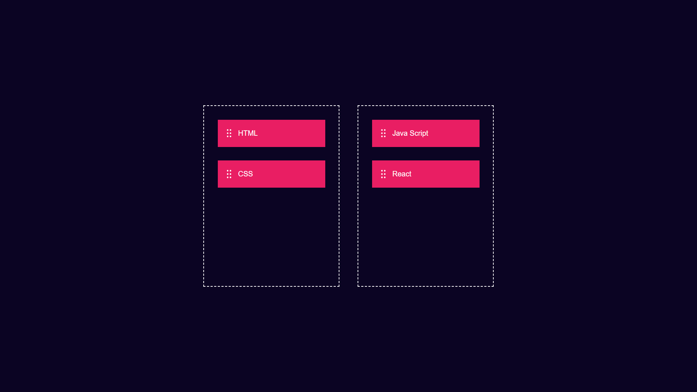

# 🎯 Drag & Drop App

A responsive Drag & Drop App built using HTML, CSS, and JavaScript. It allows users to drag and drop items between two containers through a simple and interactive interface.

---

## 🚀 Project Summary

This project demonstrates the implementation of drag-and-drop functionality using the HTML5 Drag and Drop API and JavaScript event handling. Users can easily move items between containers in real time without refreshing the page.

This project was built to strengthen my understanding of DOM manipulation, event handling, and dynamic element positioning.

---

## ✨ Features

* 🖱️ Drag and drop items between containers
* 📦 Move elements dynamically
* ⚡ Real-time interaction without page refresh
* 🎨 Modern dark-themed user interface
* 📱 Responsive design
* 🚀 Simple and user-friendly experience

---

## 🛠️ Technologies Used

* HTML5
* CSS3
* JavaScript (ES6)

---

## 📷 Project Preview



---

## 📚 Concepts Practiced

* DOM Manipulation
* Event Handling
* HTML5 Drag and Drop API
* JavaScript Events
* Dynamic Element Positioning
* CSS Flexbox
* Responsive Web Design

---

## ▶️ How to Run Locally

1. Clone the repository:

```bash
git clone https://github.com/Mohammed-Naeem-Patel/Drag-and-Drop-App.git
```

2. Open the project folder.

3. Open `index.html` in your browser.

4. Drag and drop items between the containers.

---

## 📌 Note

This project was created for learning and practicing drag-and-drop functionality, DOM manipulation, and JavaScript event handling concepts.

---

## 👨‍💻 Author

**Mohammed Naeem Patel**

BCA Student | Aspiring Full Stack Developer

---

⭐ If you found this project helpful, consider giving it a star.
